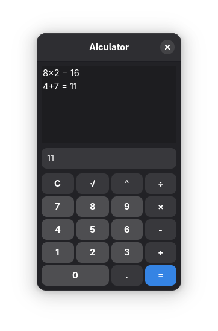

# AIculator

A calculator that uses a locally hosted LLM instead of traditional arithmetic methods to solve mathematical expressions. Written in Rust with GTK4 and Libadwaita.

Inspired by [this project](https://github.com/Calvin-LL/CalcGPT.io) I found on Hacker News a while back.

# Installation

First, you'll need to have Ollama installed, as AIculator uses it to communicate with the LLM.

```
ollama pull tinyllama
ollama serve &
```

Clone and compile AIculator.

```
git clone https://github.com/ymcx/aiculator
cd aiculator
cargo run --release
```

# Screenshot


